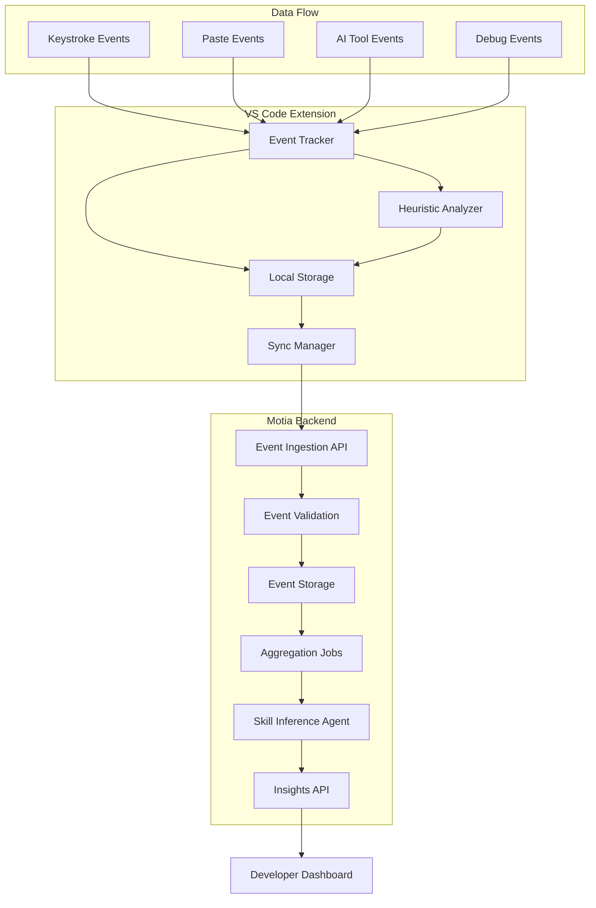

# Design Document

## Overview

The AI Development Insights system consists of two main components: a VS Code extension that tracks developer interactions with AI tools, and a Motia backend that processes and analyzes this data to provide ethical, privacy-safe insights. The system operates on an offline-first architecture, ensuring developers can work without internet connectivity while still receiving valuable insights about their AI usage patterns, prompt effectiveness, and debugging skills.

The system is designed with privacy as a core principle - no source code, raw prompts, or responses are ever collected. Instead, the system uses heuristic analysis of interaction patterns, timing data, and metadata to infer meaningful insights about developer productivity and skill development.

## Architecture

### High-Level Architecture



### Component Interaction Flow

1. **Event Collection**: VS Code extension monitors editor events and AI tool interactions
2. **Local Processing**: Events are processed locally to extract heuristic metadata
3. **Offline Storage**: Events stored in local SQLite database with append-only log
4. **Batch Sync**: When online, events are batched and sent to Motia backend
5. **Backend Processing**: Events are validated, stored, and processed through aggregation jobs
6. **Skill Inference**: Patterns are analyzed to generate insights about AI usage and debugging skills
7. **Insights Delivery**: Processed insights are made available through API endpoints

## Components and Interfaces

### VS Code Extension Components

#### Event Tracker
- **Purpose**: Monitor VS Code events and AI tool interactions
- **Responsibilities**:
  - Track keystroke bursts (timing metadata only)
  - Monitor paste events (length and timing)
  - Detect AI tool invocations (Copilot, Chat, etc.)
  - Record file switching and debug actions
  - Capture error marker appearances/disappearances

#### Local Storage Manager
- **Purpose**: Manage offline-first data persistence
- **Technology**: SQLite database with append-only event log
- **Schema**:
  ```sql
  CREATE TABLE events (
    id INTEGER PRIMARY KEY AUTOINCREMENT,
    timestamp INTEGER NOT NULL,
    event_type TEXT NOT NULL,
    metadata TEXT NOT NULL, -- JSON blob
    synced BOOLEAN DEFAULT FALSE,
    created_at INTEGER DEFAULT (strftime('%s', 'now'))
  );
  ```

#### Heuristic Analyzer
- **Purpose**: Process raw events into privacy-safe metadata
- **Key Functions**:
  - Calculate AI assistance levels (Low/Medium/High)
  - Measure human refinement ratios
  - Analyze debugging patterns
  - Generate prompt efficiency indicators

#### Sync Manager
- **Purpose**: Handle offline-first synchronization with backend
- **Features**:
  - Batch event uploads when connectivity restored
  - Idempotent upload handling
  - Retry logic with exponential backoff
  - Local storage cleanup after successful sync

### Motia Backend Components

#### Event Ingestion Workflow (API Step)
- **Endpoint**: `POST /api/events/batch`
- **Purpose**: Receive and validate batched events from VS Code extensions
- **Validation**: Event schema validation, duplicate detection, rate limiting
- **Emits**: `process-events` topic for async processing

#### Event Processing (Event Step)
- **Purpose**: Store validated events and trigger aggregation
- **Subscribes**: `process-events`
- **Storage**: Time-series database optimized for event data
- **Emits**: `aggregate-metrics` for daily processing

#### Daily Aggregation (Cron Step)
- **Schedule**: `0 2 * * *` (2 AM daily)
- **Purpose**: Generate daily per-developer metrics
- **Emits**: `infer-skills` for skill analysis

#### Skill Inference Agent (Event Step)
- **Purpose**: Analyze patterns to generate skill assessments
- **Subscribes**: `infer-skills`
- **Algorithms**:
  - Prompt efficiency scoring based on retry patterns
  - Debugging style classification
  - AI dependency analysis
  - Trend analysis for skill development

#### Insights API (API Step)
- **Endpoints**:
  - `GET /api/insights/developer/{id}` - Individual developer insights
  - `GET /api/insights/trends/{id}` - Historical trend data
  - `POST /api/insights/pause` - Pause tracking for privacy

## Data Models

### Event Data Model
```typescript
interface DeveloperEvent {
  id: string;
  developerId: string;
  timestamp: number;
  eventType: 'keystroke_burst' | 'paste' | 'ai_invocation' | 'debug_action' | 'file_switch' | 'error_marker';
  metadata: EventMetadata;
  sessionId: string;
}

interface EventMetadata {
  // Keystroke burst metadata
  burstDuration?: number;
  characterCount?: number;
  
  // Paste event metadata
  pasteLength?: number;
  timeSinceAiInvocation?: number;
  
  // AI invocation metadata
  toolType?: 'copilot' | 'chat' | 'other';
  invocationContext?: 'coding' | 'debugging' | 'documentation';
  
  // Debug action metadata
  actionType?: 'run' | 'debug' | 'test';
  errorCount?: number;
  
  // File switch metadata
  fileExtension?: string;
  switchFrequency?: number;
  
  // Error marker metadata
  errorAppeared?: boolean;
  errorResolved?: boolean;
  timeToResolve?: number;
}
```

### Aggregated Metrics Model
```typescript
interface DailyMetrics {
  developerId: string;
  date: string;
  aiAssistanceLevel: 'low' | 'medium' | 'high';
  humanRefinementRatio: number;
  promptEfficiencyScore: number;
  debuggingStyle: 'hypothesis-driven' | 'trial-and-error' | 'mixed';
  errorResolutionTime: number;
  aiDependencyRatio: number;
  sessionCount: number;
  activeTime: number; // in minutes
}
```

### Skill Assessment Model
```typescript
interface SkillAssessment {
  developerId: string;
  assessmentDate: string;
  promptMaturity: {
    score: number; // 0-100
    trend: 'improving' | 'stable' | 'declining';
    explanation: string;
  };
  debuggingSkill: {
    score: number; // 0-100
    style: 'hypothesis-driven' | 'trial-and-error' | 'mixed';
    trend: 'improving' | 'stable' | 'declining';
    explanation: string;
  };
  aiCollaboration: {
    score: number; // 0-100
    dependencyLevel: 'low' | 'medium' | 'high';
    refinementSkill: number; // 0-100
    explanation: string;
  };
}
```

## Correctness Properties

*A property is a characteristic or behavior that should hold true across all valid executions of a system-essentially, a formal statement about what the system should do. Properties serve as the bridge between human-readable specifications and machine-verifiable correctness guarantees.*

<function_calls>
<invoke name="prework">
<parameter name="featureName">ai-dev-insights

### Property Reflection

After reviewing all properties identified in the prework, several can be consolidated to eliminate redundancy:

**Privacy Properties Consolidation:**
- Properties 1.1, 1.2, 2.1, 3.1, 3.2 all relate to privacy protection and can be combined into comprehensive privacy properties
- Properties 3.3, 2.5, 6.2 all relate to trend-based output format and can be consolidated

**Correlation Properties Consolidation:**
- Properties 1.3, 7.3 both relate to AI invocation correlation and can be combined
- Properties 2.2, 2.3, 8.3 all relate to debugging analysis and can be consolidated

**Algorithm Properties Consolidation:**
- Properties 1.4, 1.5, 8.1, 8.2 relate to skill inference algorithms and can be grouped
- Properties 4.1, 4.2, 4.3, 4.5 relate to offline-first sync behavior and can be consolidated

The consolidated properties below provide unique validation value while eliminating redundancy.

### Correctness Properties

**Property 1: Privacy Protection**
*For any* system operation, all collected data should contain only metadata (timing, length, frequency) and never include source code content, AI prompts, or AI responses
**Validates: Requirements 1.1, 1.2, 2.1, 3.1, 3.2**

**Property 2: Trend-Based Output Format**
*For any* insight generation or metric calculation, the output should focus on trends and heuristic measurements rather than exact productivity scores or absolute measurements
**Validates: Requirements 2.5, 3.3, 6.2**

**Property 3: AI Correlation Accuracy**
*For any* AI tool invocation followed by editor changes, the system should correctly correlate the timing and estimate AI contribution levels without storing the actual content
**Validates: Requirements 1.3, 7.3**

**Property 4: Skill Inference Consistency**
*For any* set of interaction patterns, the skill inference algorithms should consistently classify AI assistance levels, calculate prompt efficiency scores, and generate human refinement ratios based solely on behavioral metadata
**Validates: Requirements 1.4, 1.5, 8.1, 8.2**

**Property 5: Debugging Analysis Completeness**
*For any* debugging session, the system should measure error-to-fix time, track AI usage frequency, classify debugging style, and analyze error resolution patterns without capturing error content
**Validates: Requirements 2.2, 2.3, 2.4, 8.3**

**Property 6: Offline-First Data Integrity**
*For any* network connectivity scenario, the system should store events locally when offline, batch sync when online, ensure idempotent uploads, and preserve event ordering and timestamps throughout the process
**Validates: Requirements 4.1, 4.2, 4.3, 4.5**

**Property 7: Privacy Control Responsiveness**
*For any* developer privacy request, the system should immediately pause all tracking activities and provide transparent explanations of what data is collected
**Validates: Requirements 3.5, 6.4**

**Property 8: Event Processing Pipeline**
*For any* event batch received by the backend, the system should validate events, store them, trigger aggregation jobs, and generate skill assessments through the complete processing pipeline
**Validates: Requirements 5.1, 5.2, 5.3, 5.4**

**Property 9: Heuristic Measurement Consistency**
*For any* data collection or analysis operation, all measurements should be approximate and heuristic rather than exact, maintaining consistency across all tracking scenarios
**Validates: Requirements 3.4, 6.1**

**Property 10: Editor Event Tracking Completeness**
*For any* VS Code session, the system should track all relevant events (file switching, undo/redo, run/debug actions, keystroke bursts, edit distances) while maintaining editor performance
**Validates: Requirements 7.1, 7.2, 7.4**

**Property 11: Data Retention Compliance**
*For any* stored data, the system should implement automatic purging based on retention policies and maintain storage capacity limits through intelligent event management
**Validates: Requirements 4.4, 6.3**

**Property 12: Insight Explanation Completeness**
*For any* generated skill assessment or insight, the system should provide explanatory context and use rolling averages to show improvement trends over time
**Validates: Requirements 8.4, 8.5**

## Error Handling

### VS Code Extension Error Handling

**Event Collection Errors**:
- Graceful degradation when VS Code APIs are unavailable
- Fallback mechanisms for different VS Code versions
- Error logging without exposing sensitive information

**Local Storage Errors**:
- SQLite database corruption recovery
- Disk space management and cleanup
- Transaction rollback on write failures

**Sync Errors**:
- Network timeout handling with exponential backoff
- Partial sync recovery mechanisms
- Conflict resolution for duplicate events

### Motia Backend Error Handling

**Event Ingestion Errors**:
- Invalid event schema validation with detailed error responses
- Rate limiting with appropriate HTTP status codes
- Duplicate event detection and idempotent handling

**Processing Errors**:
- Failed aggregation job retry mechanisms
- Skill inference algorithm error recovery
- Data consistency checks and repair procedures

**API Errors**:
- Authentication and authorization error handling
- Request validation with clear error messages
- Service unavailability graceful responses

## Testing Strategy

### Dual Testing Approach

The system requires both unit testing and property-based testing to ensure comprehensive coverage:

**Unit Tests** verify specific examples, edge cases, and error conditions:
- Specific event processing scenarios
- API endpoint behavior with known inputs
- Error handling for edge cases
- Integration between VS Code extension and local storage

**Property-Based Tests** verify universal properties across all inputs:
- Privacy protection across all data collection scenarios
- Sync behavior under various network conditions
- Skill inference consistency across different interaction patterns
- Data integrity throughout the processing pipeline

### Property-Based Testing Framework

**Framework Selection**: 
- **VS Code Extension (TypeScript)**: fast-check library
- **Motia Backend (TypeScript)**: fast-check library
- **Integration Tests**: fast-check with custom generators

**Test Configuration**:
- Minimum 100 iterations per property test
- Custom generators for realistic developer interaction patterns
- Shrinking strategies for complex event sequences

**Property Test Implementation Requirements**:
- Each property-based test must run a minimum of 100 iterations
- Each test must be tagged with a comment referencing the design document property
- Tag format: `**Feature: ai-dev-insights, Property {number}: {property_text}**`
- Each correctness property must be implemented by a single property-based test

### Test Data Generation

**Event Generators**:
- Realistic keystroke burst patterns
- AI invocation sequences with timing variations
- Debugging session simulations
- Network connectivity state changes

**Privacy Validation**:
- Generators that include sensitive data to verify it's never stored
- Content validation to ensure only metadata is captured
- Output format validation for trend-based insights

### Integration Testing

**End-to-End Scenarios**:
- Complete developer workflow simulation
- Offline-to-online sync validation
- Multi-day skill assessment progression
- Privacy control activation and deactivation

**Performance Testing**:
- Large event volume processing
- Concurrent user scenarios
- Storage capacity limit handling
- Sync performance under various network conditions