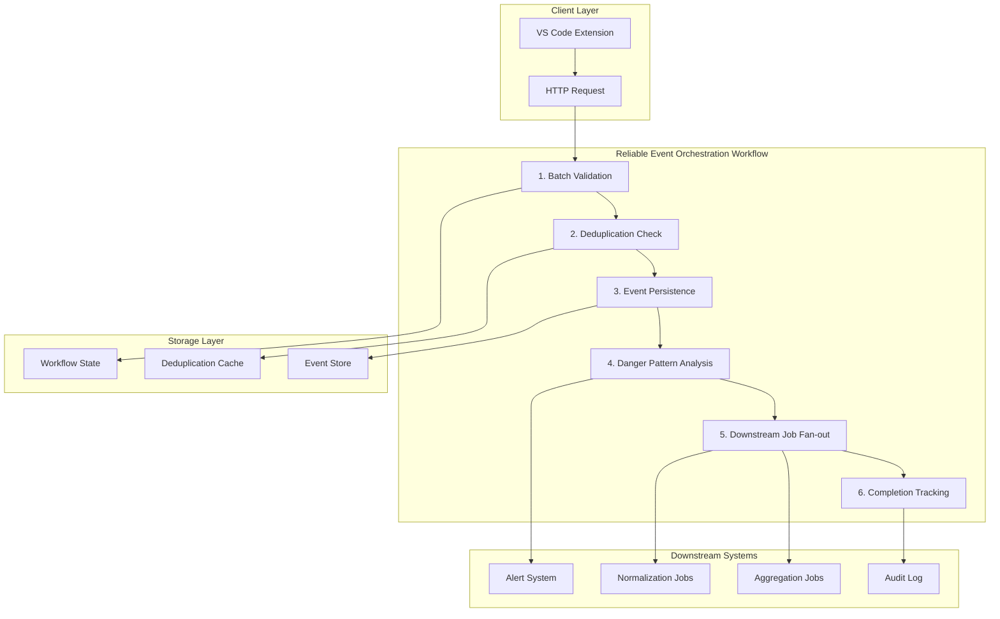
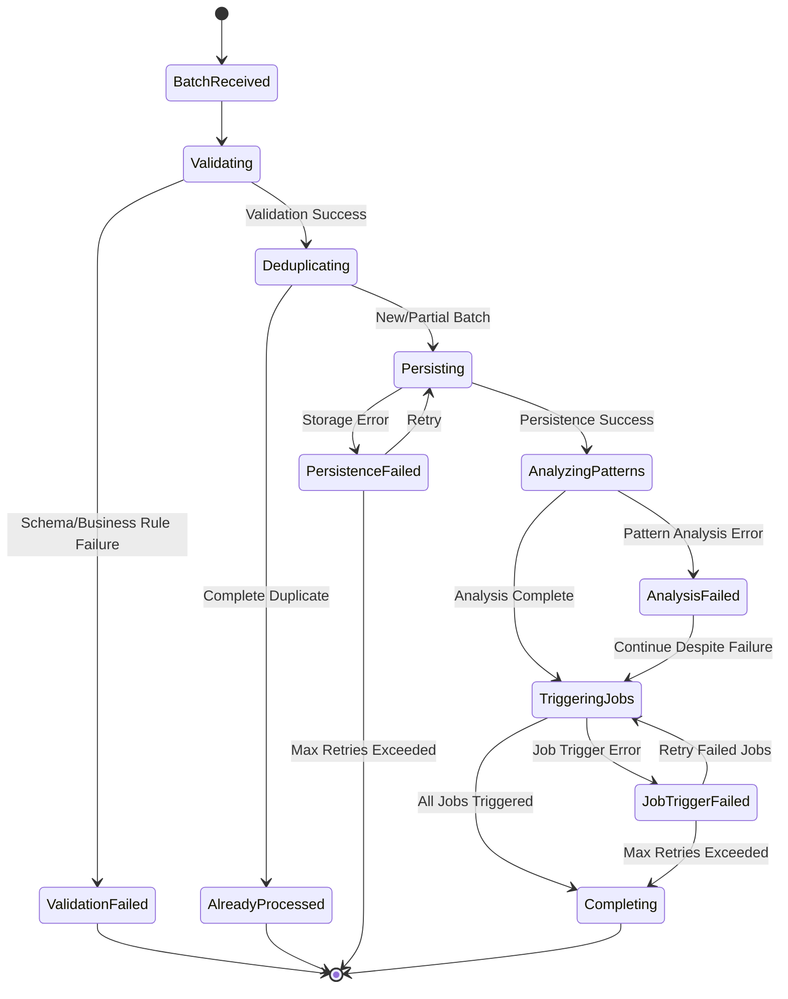

# Design Document

## Overview

The Reliable Event Orchestration Workflow is a production-grade Motia workflow designed to handle the complex requirements of ingesting, validating, and orchestrating developer activity events from VS Code extensions. Unlike a simple REST handler, this workflow provides comprehensive error handling, idempotency guarantees, replay capabilities, and robust downstream job orchestration.

The workflow operates as a multi-step process that ensures no events are lost, duplicates are handled gracefully, and all downstream systems receive properly validated and enriched event data. The design prioritizes reliability, observability, and maintainability while maintaining fast response times for client acknowledgments.

## Architecture

### Workflow vs REST Handler Justification

**Why This Must Be a Workflow Instead of a REST Handler:**

1. **Complex State Management**: The workflow needs to track processing state across multiple steps, handle partial failures, and maintain correlation between batch ingestion and downstream job triggers
2. **Retry and Recovery Logic**: Each step requires different retry strategies and failure handling - validation failures vs storage failures vs job trigger failures need different approaches
3. **Idempotency Across Multiple Operations**: True idempotency requires coordinating deduplication, storage, and job triggering as atomic operations
4. **Audit Trail Requirements**: Complete traceability requires state persistence across workflow steps with correlation IDs
5. **Fan-out Orchestration**: Triggering multiple downstream jobs with proper error isolation and retry logic
6. **Replay Capabilities**: Supporting event replay requires workflow state management and conditional execution paths

### High-Level Workflow Architecture



### Workflow State Transitions



## Components and Interfaces

### Workflow Entry Point (API Step)

**Endpoint**: `POST /api/workflow/events/orchestrate`

**Purpose**: Initiate the reliable event orchestration workflow

**Request Schema**:
```typescript
interface OrchestrationRequest {
  batchId: string;
  events: DeveloperEvent[];
  timestamp: number;
  clientVersion: string;
  retryAttempt?: number;
}
```

**Response Schema**:
```typescript
interface OrchestrationResponse {
  success: boolean;
  workflowId: string;
  batchId: string;
  message: string;
  processedCount?: number;
  errors?: ValidationError[];
}
```

### Workflow Steps

#### Step 1: Batch Validation
- **Purpose**: Comprehensive validation of event batch and individual events
- **Validations**:
  - Schema version compatibility
  - Event structure validation
  - Business rule validation (timestamp ranges, developer ID format)
  - Batch size limits and rate limiting
- **Outputs**: Validated events list, validation errors
- **Failure Handling**: Return validation errors to client, do not proceed

#### Step 2: Deduplication Check
- **Purpose**: Ensure idempotent processing using batch and event-level deduplication
- **Strategy**:
  - Batch-level: Check if batchId has been fully processed
  - Event-level: Check individual event IDs against processed events cache
  - Partial batch handling: Process only new events from partially processed batches
- **Storage**: Redis-based deduplication cache with TTL
- **Outputs**: New events to process, duplicate event count

#### Step 3: Event Persistence
- **Purpose**: Durably store validated events with atomic operations
- **Storage Strategy**:
  - Primary storage: Time-series database (InfluxDB or TimescaleDB)
  - Backup storage: Append-only log for replay capabilities
  - Transaction management: Ensure all-or-nothing persistence
- **Retry Logic**: Exponential backoff with jitter, circuit breaker pattern
- **Outputs**: Persistence confirmation, stored event count

#### Step 4: Danger Pattern Analysis
- **Purpose**: Real-time analysis for developer health and productivity alerts
- **Patterns Detected**:
  - Excessive error rates (>50 errors/hour)
  - Extended debugging sessions (>4 hours continuous debugging)
  - High AI dependency (>80% AI-generated code)
  - Repetitive failure patterns (same error >10 times)
  - Unusual working hours (coding between 2-6 AM consistently)
- **Alert Generation**: Immediate notifications with severity levels
- **Failure Isolation**: Pattern analysis failures do not block main workflow

#### Step 5: Downstream Job Fan-out
- **Purpose**: Trigger multiple downstream processing jobs with proper orchestration
- **Jobs Triggered**:
  - **Aggregation Job**: Daily/hourly metric calculation
  - **Normalization Job**: Data standardization and enrichment
  - **Skill Inference Job**: AI-based skill assessment (if sufficient data)
  - **Trend Analysis Job**: Historical pattern analysis
- **Orchestration Strategy**:
  - Parallel job triggering with individual retry logic
  - Job dependency management (normalization before skill inference)
  - Failure isolation (one job failure doesn't affect others)

#### Step 6: Completion Tracking
- **Purpose**: Mark workflow completion and update audit trail
- **Activities**:
  - Update workflow state to completed
  - Log final processing metrics
  - Update deduplication cache with completion markers
  - Generate completion audit log entry

### Workflow State Management

**State Schema**:
```typescript
interface WorkflowState {
  workflowId: string;
  batchId: string;
  status: 'running' | 'completed' | 'failed' | 'retrying';
  currentStep: string;
  startTime: number;
  lastUpdateTime: number;
  eventCount: number;
  processedCount: number;
  errors: WorkflowError[];
  retryCount: number;
  correlationId: string;
}
```

**State Persistence**: Redis with TTL for active workflows, PostgreSQL for completed workflows

## Data Models

### Enhanced Event Model
```typescript
interface DeveloperEvent {
  id: string;
  developerId: string;
  timestamp: number;
  eventType: EventType;
  metadata: EventMetadata;
  sessionId: string;
  // Orchestration metadata
  batchId: string;
  workflowId: string;
  processingTimestamp: number;
  schemaVersion: string;
}
```

### Deduplication Cache Model
```typescript
interface DeduplicationEntry {
  batchId: string;
  eventIds: string[];
  status: 'processing' | 'completed' | 'failed';
  timestamp: number;
  ttl: number;
}
```

### Danger Pattern Model
```typescript
interface DangerPattern {
  patternId: string;
  developerId: string;
  patternType: 'excessive_errors' | 'extended_debugging' | 'high_ai_dependency' | 'repetitive_failures' | 'unusual_hours';
  severity: 'low' | 'medium' | 'high' | 'critical';
  detectedAt: number;
  eventIds: string[];
  metadata: PatternMetadata;
  alertSent: boolean;
}
```

### Workflow Audit Model
```typescript
interface WorkflowAuditEntry {
  auditId: string;
  workflowId: string;
  batchId: string;
  step: string;
  action: string;
  timestamp: number;
  duration: number;
  success: boolean;
  errorMessage?: string;
  metadata: Record<string, any>;
  correlationId: string;
}
```

## Correctness Properties

*A property is a characteristic or behavior that should hold true across all valid executions of a system-essentially, a formal statement about what the system should do. Properties serve as the bridge between human-readable specifications and machine-verifiable correctness guarantees.*

### Property Reflection

After reviewing all properties identified in the prework, several can be consolidated to eliminate redundancy:

**Batch Processing Properties Consolidation:**
- Properties 1.1, 1.2, 1.3, 1.5 all relate to batch handling and can be combined into comprehensive batch processing properties
- Properties 1.4, 5.3, 5.4 all relate to idempotency and can be consolidated

**Validation and Persistence Properties Consolidation:**
- Properties 2.1, 2.2, 2.3 relate to validation and persistence flow and can be combined
- Properties 2.4, 2.5 relate to persistence confirmation and can be consolidated

**Job Orchestration Properties Consolidation:**
- Properties 3.1, 3.2, 3.3, 3.5 all relate to downstream job triggering and can be combined
- Property 3.4 is unique and should remain separate

**Pattern Analysis Properties Consolidation:**
- Properties 4.1, 4.2, 4.3, 4.5 relate to danger pattern detection and alerting and can be combined
- Property 4.4 is unique (failure isolation) and should remain separate

**Failure Handling Properties Consolidation:**
- Properties 5.1, 5.2, 5.5 relate to failure handling and retry logic and can be combined

**Performance Properties Consolidation:**
- Properties 6.1, 6.2 relate to computation constraints and can be combined
- Properties 6.3, 6.4, 6.5 relate to performance timing and can be consolidated

**Audit Trail Properties Consolidation:**
- Properties 7.1, 7.2, 7.3, 7.4, 7.5 all relate to comprehensive logging and can be combined

The consolidated properties below provide unique validation value while eliminating redundancy.

### Correctness Properties

**Property 1: Batch Processing Resilience**
*For any* event batch with unique IDs and timestamps, the workflow should accept and process events correctly regardless of arrival order, timing, or chronological sequence, while maintaining event ordering within each batch
**Validates: Requirements 1.1, 1.2, 1.3, 1.5**

**Property 2: Idempotent Processing**
*For any* event batch sent multiple times, the workflow should process it idempotently without creating duplicates, and replay operations should maintain idempotency without causing duplicate downstream processing
**Validates: Requirements 1.4, 5.3, 5.4**

**Property 3: Validation and Persistence Flow**
*For any* event batch, the workflow should validate each event against the current schema version, handle version mismatches gracefully, and persist valid events to durable storage immediately with proper confirmation responses
**Validates: Requirements 2.1, 2.2, 2.3, 2.5**

**Property 4: Persistence Retry Consistency**
*For any* storage operation failure, the workflow should retry with exponential backoff while maintaining data consistency throughout the retry process
**Validates: Requirements 2.4**

**Property 5: Downstream Job Orchestration**
*For any* successfully persisted event batch, the workflow should trigger all required downstream jobs (aggregation, normalization) with complete event batch metadata and processing context, and mark the batch as fully processed when all jobs are triggered
**Validates: Requirements 3.1, 3.2, 3.3, 3.5**

**Property 6: Job Trigger Retry Isolation**
*For any* downstream job trigger failure, the workflow should retry job triggering without re-processing the original events
**Validates: Requirements 3.4**

**Property 7: Danger Pattern Detection and Alerting**
*For any* event batch, the workflow should analyze events for predefined danger patterns, generate immediate alerts with pattern details and recommended actions when patterns are detected, and prioritize multiple alerts based on severity levels
**Validates: Requirements 4.1, 4.2, 4.3, 4.5**

**Property 8: Pattern Analysis Failure Isolation**
*For any* danger pattern analysis failure, the workflow should continue processing the main workflow without blocking
**Validates: Requirements 4.4**

**Property 9: Comprehensive Failure Handling**
*For any* processing failure, the workflow should isolate failed events while continuing to process successful ones, implement proper retry logic with exponential backoff and circuit breaker patterns, and trigger administrative alerts when retry limits are exceeded
**Validates: Requirements 5.1, 5.2, 5.5**

**Property 10: Performance and Computation Constraints**
*For any* workflow execution, the system should not perform skill inference, complex analytics, or aggregated metric computation during the main workflow, and should complete basic validation and persistence within 500ms for typical batch sizes
**Validates: Requirements 6.1, 6.2, 6.3**

**Property 11: Asynchronous Processing and Response Timing**
*For any* downstream job triggering, the workflow should use asynchronous processing to avoid blocking, and provide client acknowledgments immediately after successful persistence
**Validates: Requirements 6.4, 6.5**

**Property 12: Comprehensive Audit Trail**
*For any* workflow operation, the system should log all processing steps with timestamps and correlation IDs, log deduplication decisions with original event references, log job trigger events with batch correlation information, log detailed error context for failures, and clearly distinguish replay operations from original processing in logs
**Validates: Requirements 7.1, 7.2, 7.3, 7.4, 7.5**

## Error Handling

### Workflow-Level Error Handling

**Step Failure Isolation**:
- Each workflow step operates independently with its own error boundaries
- Step failures trigger step-specific retry logic without affecting other steps
- Critical failures (validation, persistence) halt workflow; non-critical failures (pattern analysis) continue workflow

**Retry Strategies by Step**:
- **Validation Step**: No retries (fail fast for invalid data)
- **Deduplication Step**: 3 retries with exponential backoff (cache connectivity issues)
- **Persistence Step**: 5 retries with exponential backoff + jitter (database connectivity)
- **Pattern Analysis Step**: 2 retries, then continue (non-blocking)
- **Job Triggering Step**: 3 retries per job, independent failure handling

**Circuit Breaker Implementation**:
- Per-step circuit breakers with configurable thresholds
- Automatic recovery testing with half-open states
- Graceful degradation for non-critical steps

### Data Consistency Guarantees

**Transactional Boundaries**:
- Event persistence and deduplication cache updates in single transaction
- Workflow state updates atomic with step completion
- Job trigger records persisted before actual job triggering

**Consistency Models**:
- **Strong Consistency**: Event storage and deduplication
- **Eventual Consistency**: Downstream job processing
- **Best Effort**: Danger pattern analysis and alerting

**Rollback Strategies**:
- Compensation actions for failed workflow steps
- Idempotent cleanup operations for partial failures
- Manual intervention procedures for consistency violations

### Monitoring and Alerting

**Workflow Health Metrics**:
- Processing latency per step and end-to-end
- Error rates by step and error type
- Retry frequency and success rates
- Circuit breaker state changes

**Alert Conditions**:
- Workflow failure rate >5% over 5 minutes
- Processing latency >1 second for 95th percentile
- Circuit breaker open for >2 minutes
- Deduplication cache hit rate <90%

## Testing Strategy

### Dual Testing Approach

The system requires both unit testing and property-based testing to ensure comprehensive coverage:

**Unit Tests** verify specific examples, edge cases, and error conditions:
- Specific workflow step behaviors with known inputs
- Error handling scenarios for each step
- Integration between workflow steps
- Specific danger pattern detection scenarios

**Property-Based Tests** verify universal properties across all inputs:
- Batch processing resilience across various event patterns
- Idempotency across different failure scenarios
- Performance constraints under various load conditions
- Audit trail completeness across all execution paths

### Property-Based Testing Framework

**Framework Selection**: 
- **Motia Workflow (TypeScript)**: fast-check library
- **Integration Tests**: fast-check with custom workflow generators

**Test Configuration**:
- Minimum 100 iterations per property test
- Custom generators for realistic event batch patterns
- Shrinking strategies for complex workflow failure scenarios

**Property Test Implementation Requirements**:
- Each property-based test must run a minimum of 100 iterations
- Each test must be tagged with a comment referencing the design document property
- Tag format: `**Feature: reliable-event-orchestration, Property {number}: {property_text}**`
- Each correctness property must be implemented by a single property-based test

### Test Data Generation

**Event Batch Generators**:
- Realistic developer event patterns with temporal clustering
- Out-of-order event sequences with various time skews
- Duplicate batch scenarios with partial overlaps
- Invalid event patterns for validation testing

**Failure Scenario Generators**:
- Network connectivity failures at various workflow steps
- Database connectivity issues with different failure patterns
- Downstream job trigger failures with various error types
- Circuit breaker state transitions

**Performance Test Generators**:
- Large batch sizes approaching system limits
- High-frequency batch submissions
- Concurrent workflow executions
- Memory and CPU stress patterns

### Integration Testing

**End-to-End Workflow Scenarios**:
- Complete developer event lifecycle simulation
- Multi-batch processing with various timing patterns
- Failure recovery and replay scenarios
- Danger pattern detection and alerting flows

**Chaos Engineering**:
- Random step failures during workflow execution
- Network partitions between workflow components
- Database failover scenarios
- Cache eviction and recovery testing

**Performance and Load Testing**:
- Sustained high-throughput event processing
- Burst traffic handling capabilities
- Resource utilization under various load patterns
- Scalability limits and degradation patterns

## Deployment and Operations

### Workflow Configuration

**Environment-Specific Settings**:
```typescript
interface WorkflowConfig {
  retryLimits: {
    validation: number;
    deduplication: number;
    persistence: number;
    patternAnalysis: number;
    jobTriggering: number;
  };
  timeouts: {
    stepTimeout: number;
    workflowTimeout: number;
    jobTriggerTimeout: number;
  };
  circuitBreaker: {
    failureThreshold: number;
    recoveryTimeout: number;
    halfOpenMaxCalls: number;
  };
  performance: {
    maxBatchSize: number;
    processingTimeoutMs: number;
    concurrentWorkflows: number;
  };
}
```

### Monitoring and Observability

**Key Metrics**:
- Workflow completion rate and latency
- Step-by-step processing times
- Error rates by step and error type
- Deduplication effectiveness
- Downstream job trigger success rates

**Distributed Tracing**:
- End-to-end request tracing with correlation IDs
- Step-level span creation with detailed metadata
- Cross-service trace propagation for downstream jobs

**Logging Strategy**:
- Structured logging with consistent correlation IDs
- Step-level progress logging with timing information
- Error logging with full context and stack traces
- Audit logging for compliance and debugging

### Scalability Considerations

**Horizontal Scaling**:
- Stateless workflow execution with external state storage
- Load balancing across multiple workflow instances
- Partitioned deduplication cache for high throughput

**Resource Management**:
- Memory-efficient event processing with streaming
- CPU optimization for validation and pattern analysis
- I/O optimization for persistence operations

**Capacity Planning**:
- Baseline: 1000 events/second per workflow instance
- Peak: 5000 events/second with auto-scaling
- Storage: 1TB/month event data with compression
- Cache: 10GB deduplication cache with LRU eviction